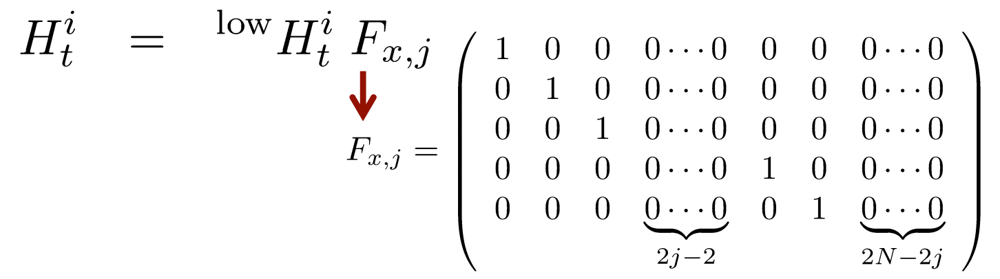

<!--
 * @Author: LOTEAT
 * @Date: 2024-08-04 10:32:01
-->
## Extended Kalman Filter Demo

This is a repository for `Extended Kalman Filter`. If you want to know more about `Extended Kalman Filte`, you can read a book named `Probabilistic Robotics`. Thanks to [this course](http://ais.informatik.uni-freiburg.de/teaching/ws13/mapping/index_en.php) which provides a framework.

### 1. Data Format
[This course](http://ais.informatik.uni-freiburg.de/teaching/ws13/mapping/index_en.php) provides the information of sensors and landmarks. In `sensor_data.txt`, the data is like:
```shell
ODOMETRY 0.100692392654 0.100072845247 0.000171392857486
SENSOR1 1.89645381418 0.374031885671
SENSOR2 3.85367751107 1.51951017943
ODOMETRY 0.0993660353102 0.0999680211112 -0.000241341506349
SENSOR1 1.8392269046 0.248025655056
SENSOR2 3.91387355108 1.39726707495
...
```
For the line with `ODOMETRY`, it consists of the $\delta_{rot1}, \delta_{trans}, \delta_{rot2}$. For example, in **ODOMETRY 0.100692392654 0.100072845247 0.000171392857486**, $\delta_{rot1}=0.100692392654, \delta_{trans}=0.100072845247, \delta_{rot2}=0.000171392857486$, repectively.

The followings are landmarks observed by the robot. For example, in **SENSOR1 1.89645381418 0.374031885671**, `SENSOR1` is the id of observed landmark, **1.89645381418, 0.374031885671** are the `range` and `bearing`, respectively.

Note that the data is formatted as (ODOMETRY, SENSOR, SENSOR, ODOMETRY, SENSOR, ODOMETRY, SENSOR...). Several `SENSORs` are following one `ODOMETRY`, and they are at the same timestamp.

### 2. Odometry Motion Model
The odometry motion model is as follows

$$
\left(\begin{array}{l}
x' \\
y' \\
\theta'
\end{array}\right)=
\left(\begin{array}{l}
x \\
y \\
\theta
\end{array}\right)+\left(\begin{array}{c}
\delta_{trans}cos(\theta + \delta_{rot1}) \\
\delta_{trans}sin(\theta + \delta_{rot1}) \\
\delta_{rot1} + \delta_{rot2}
\end{array}\right)
$$

### 3. Extended Kalman Filter Model

#### 3.1 Overview
<center>
    
    <br>
    <div style="color:orange; border-bottom: 1px solid #d9d9d9;
    display: inline-block;
    color: #999;
    padding: 2px;">
    Figure 1. The update process of EKF filter.
  	</div>
</center>
The update process of EKF filter is shown in Fig.1. In EKF, the state transition probability and the measurement probabilities are governed by nonlinear functions g and h, respectively:

$$
\begin{aligned}
& x_t = g(u_t, x_{t-1}) + \epsilon_t \\
& z_t = h(x_t) + \delta_t \\
\end{aligned}
$$

Note that in this repository, $x_t = [x, y, \theta, m_{1,x}, m_{1,y}, ..., m_{n,x}, m_{n,y}]^T$, where $x, y$ is the coordinates of the robot, $\theta$ is the yaw angle, r is the range and b is the bearning. $n$ means that we have $n$ landmarks totally. We use $o_t$ to represent $[x_t, y_t, \theta_t]^T$, where $x_t, y_t, \theta_t$ is the x-axis coordinate, y-axis coordinate, yaw angle of the robot at timestamp $t$, respectively. $m_{t} = [m_t^{1,x}, m_t^{1,y}, m_t^{2,x}, m_t^{2,y}, ..., m_t^{n,x}, m_t^{n,y}]^T$, where $m_t^{i,x}, m_t^{i,y}$ is the x-axis coordinate and y-axis coordinate of landmark $i$ at timestamp $t$, respectively. $u_t = [\delta_{rot1}, \delta_{trans}, \delta_{rot2}]^T$.

#### 3.2 Initialization

We need speicify the $\mu_0$ and $\Sigma_0$. For $o_0$, we just think the robot is at the origin point of the coordinate, which means that $o_0=[0, 0, 0]^T$. For the covariance of $o_0$, since we know the original pose exactly, the error is 0. Therefore, the covariance is $\mathbf{0}_{3\times3}$. For landmarks, we know nothing about it. Therefore, $m_{t-1}$ can be assigned $\mathbf{0}_{2n\times 1}$, and the covariance is $\mathbf{I}_{2n \times 2n} \times inf$, where $\mathbf{I}$ is the indentity matrix and $inf$ is a large enough number.

We combine them together
$$
\mu_0 = \mathbf{0}_{(2n+3) \times 1}
$$

$$
\Sigma_0 = 
\left(\begin{array}{cc}
\mathbf{0}_{3\times 3} & \mathbf{0}_{3\times 2n} \\
\mathbf{0}_{2n \times 3} & \mathbf{I}_{2n \times 2n} \times inf \\
\end{array}\right) 
$$

#### 3.3 Prediction

We firstly ignore range and bearing, which is 

$$
\begin{aligned}
& o_t = g(u_t, o_{t-1}) + \epsilon_t \\
& z_t = h(o_t) + \delta_t \\
\end{aligned}
$$

We can further expand this equation

$$
\left(\begin{array}{l}
x_t \\
y_t \\
\theta_t
\end{array}\right)=
\left(\begin{array}{c}
x_{t-1}+ \delta_{trans}cos(\theta + \delta_{rot1}) \\
y_{t-1} + \delta_{trans}sin(\theta + \delta_{rot1}) \\
\theta_{t-1} + \delta_{rot1} + \delta_{rot2}
\end{array}\right) + \epsilon_t
$$

It means that
$$
\begin{aligned}
g(u_t, o_{t-1}) & = g(\delta_{rot1}, \delta_{trans}, \delta_{rot2},x_{t-1}, y_{t-1}, \theta_{t-1}) \\
& =
\left(\begin{array}{c}
x_{t-1}+ \delta_{trans}cos(\theta + \delta_{rot1}) \\
y_{t-1} + \delta_{trans}sin(\theta + \delta_{rot1}) \\
\theta_{t-1} + \delta_{rot1} + \delta_{rot2}
\end{array}\right)
\end{aligned}\\
$$
If we let 
$$
\left(\begin{array}{c}
g_x({x_{t-1}, y_{t-1}, \theta_{t-1}}) \\
g_y({x_{t-1}, y_{t-1}, \theta_{t-1}}) \\
g_{theta}({x_{t-1}, y_{t-1}, \theta_{t-1}})
\end{array}\right)
=\left(\begin{array}{c}
x_{t-1}+ \delta_{trans}cos(\theta + \delta_{rot1}) \\
y_{t-1} + \delta_{trans}sin(\theta + \delta_{rot1}) \\
\theta_{t-1} + \delta_{rot1} + \delta_{rot2}
\end{array}\right)
$$
We can easily calculate the patial derivative of the $g$, which is 

$$
\frac{\partial{g(u_t, o_{t-1}) }}{\partial{o_{t-1}}} =
\left(\begin{array}{ccc}
\frac{\partial{g_x}}{x_{t-1}} & \frac{\partial{g_x}}{y_{t-1}} &  \frac{\partial{g_x}}{\theta_{t-1}}\\
\frac{\partial{g_y}}{x_{t-1}} & \frac{\partial{g_x}}{y_{t-1}} &  \frac{\partial{g_y}}{\theta_{t-1}} \\
\frac{\partial{g_\theta}}{x_{t-1}} & \frac{\partial{g_\theta}}{y_{t-1}} &  \frac{\partial{g_{\theta}}}{\theta_{t-1}}
\\
\end{array}\right)
$$

We further simplify this equation

$$
\frac{\partial{g(u_t, o_{t-1}) }}{\partial{o_{t-1}}} =
\left(\begin{array}{ccc}
1 & 0 & -\delta_{trans}sin(\theta + \delta_{rot1}) \\
0 & 1 & \delta_{trans}cos(\theta + \delta_{rot1}) \\
0 & 0 &  1
\\
\end{array}\right)
$$

Next, we need to consider the range and bearing. However, we can easily find that motion model has no influence on the measurement, so $\frac{\partial{g(u_t, o_{t-1})}}{\partial{m_{t-1}}} = \mathbf{0}_{3\times 2n}$. The same for $\frac{\partial{g(u_t, m_{t-1})}}{\partial{o_{t-1}}} = \mathbf{0}_{2n \times 3}$. And $g(u_t, m_{t-1}) = m_{t-1}$, so $\frac{\partial{g(u_t, m_{t-1})}}{\partial{m_{t-1}}} = \mathbf{I}_{2n \times 2n}$.

Finally, we get the partial derivative of $g(u_t, x_{t-1})$, which is 

$$
G_t = 
\frac{\partial{g(u_t, o_{t-1}) }}{\partial{o_{t-1}}} =
\left(\begin{array}{cc}
\frac{\partial{g(u_t, o_{t-1}) }}{\partial{o_{t-1}}} & \mathbf{0}_{3\times 2n}  \\
\mathbf{0}_{2n \times 3} & \mathbf{I}_{2n \times 2n} & \\
\end{array}\right)
$$

For the motion noise, we simply specify it as 
$$
R_t = 
\left(\begin{array}{cc}
\left(\begin{array}{ccc}
0.1 & 0 & 0\\
0 & 0.1 & 0\\
0 & 0 & 0.01\\
\end{array}\right) & \mathbf{0}_{3 \times 2n} \\
\mathbf{0}_{2n \times 3} & \mathbf{0}_{2n \times 2n} \\
\end{array}\right)
$$

#### 3.4 Correction

For now, we know $\bar{x}_t=[\bar{o}_t, \bar{m}_t]^T$. We add a bar because $\bar{x}_t$ is predicted by the motion model Actually, not all landmarks can be observed, but we can firstly simplfiy this problem by assuming that the robot can see all the landmarks. From $\bar{x}_t$, we can quickly compute the expected $z_t$, which is

$$
\bar{\delta}_t^i
=\left(\begin{array}{c}
\bar{\delta}_t^{i,x} \\
\bar{\delta}_t^{i,y}
\end{array}\right) 
= \left(\begin{array}{c}
\bar{m}_t^{i, x} - \bar{x}_t \\
\bar{m}_t^{i, y} - \bar{y}_t
\end{array}\right) \\
\bar{r}_t^{i} = 
\sqrt{{\bar{\delta}_t^i}^T\bar{\delta}_t^i
}\\
\bar{b}_t^i = arctan2(\bar{\delta}_t^{i,y}, \bar{\delta}_t^{i,x}) - \bar{\theta}_t
$$

So far, we get the expression of $h$, which is 
$$
z_t^i = h(\bar{x}_t) + \delta_t = 
\left(\begin{array}{c}
h_r(\bar{x}_t) \\
h_b(\bar{x}_t) \\
\end{array}\right) = \left(\begin{array}{c}
\sqrt{{\bar{\delta}_t^i}^T\bar{\delta}_t^i} \\
arctan2(\bar{\delta}_t^{i,y}, \bar{\delta}_t^{i,x}) - \bar{\theta}_t
\end{array}\right) + \delta_t
$$
where $\delta_t$ is the noise.

We can easily calculate the partial derivatives of $z_t^i$, which is 
$$
\frac{\partial{z_t^i}}{\partial{\bar{x}_t}} = 
\left(\begin{array}{c}
\frac{\partial{h_r(\bar{x}_t)}}{\partial{\bar{x}_t}} &
 \frac{\partial{h_r(\bar{x}_t)}}{\partial{\bar{y}_t}} & 
 \frac{\partial{h_r(\bar{x}_t)}}{\partial{\bar{\theta}_t}} &
 \frac{\partial{h_r(\bar{x}_t)}}{\partial{\bar{m}_t^{i, x}}} &
  \frac{\partial{h_r(\bar{x}_t)}}{\partial{\bar{m}_t^{i, y}}} \\
  \frac{\partial{h_b(\bar{x}_t)}}{\partial{\bar{x}_t}} &
 \frac{\partial{h_b(\bar{x}_t)}}{\partial{\bar{y}_t}} & 
 \frac{\partial{h_b(\bar{x}_t)}}{\partial{\bar{\theta}_t}} &
 \frac{\partial{h_b(\bar{x}_t)}}{\partial{\bar{m}_t^{i, x}}} &
  \frac{\partial{h_b(\bar{x}_t)}}{\partial{\bar{m}_t^{i, y}}} \\
\end{array}\right)
$$

Note that in this equation, some $\bar{x}_t$s represent the x-axis coordinate, some represent the whole vector.

We further simplify this equation. 

$$
\frac{\partial{z_t^i}}{\partial{\bar{x}_t}} = 
\left(\begin{array}{c}
-\frac{\bar{\delta}_t^{i,x}}{\bar{r}_t^i} &
-\frac{\bar{\delta}_t^{i,y}}{\bar{r}_t^i} & 
 0 &
 \frac{\bar{\delta}_t^{i,x}}{\bar{r}_t^i} &
  \frac{\bar{\delta}_t^{i,y}}{\bar{r}_t^i} \\
  \frac{\bar{\delta}_t^{i,y}}{{\bar{r}_t^i}^2} &
 -\frac{\bar{\delta}_t^{i,x}}{{\bar{r}_t^i}^2} & 
 -1 &
 -\frac{\bar{\delta}_t^{i,y}}{{\bar{r}_t^i}^2}  &
  \frac{\bar{\delta}_t^{i,x}}{{\bar{r}_t^i}^2} \\
\end{array}\right)
$$

By the way, you may need this equation: 
$$
\frac{\partial{arctan2(y, x)}}{\partial{x}}= \frac{-y}{x^2+y^2} \\
\frac{\partial{arctan2(y, x)}}{\partial{y}}= \frac{x}{x^2+y^2}
$$


Now, back to the first issue, not all the landmarks can be observed at one timestamp. Therefore, if the robot find a landmark which has not been seen before, we use the measurement to set up the coordinate of the landmark. Then, we need to map ${}^{low}H_t^i =\frac{\partial{z_t^i}}{\partial{\bar{x}_t}}$ to a high-dimension space, because we need to add $\frac{\partial{z_t^i}}{\partial{m_t^{1,x}}}, \frac{\partial{z_t^i}}{\partial{m_t^{1,y}}}, ..., \frac{\partial{z_t^i}}{\partial{m_t^{n,x}}}, \frac{\partial{z_t^i}}{\partial{m_t^{n,y}}}$. Actually, these partial derivatives are zero, and we can use a mapping matrix 
<center>
    
    <br>
    <div style="color:orange; border-bottom: 1px solid #d9d9d9;
    display: inline-block;
    color: #999;
    padding: 2px;">
    Figure 2. Mapping matrix
  	</div>
</center>

And the final $H_t$ is the concatenation of all the $H_t^i$.

For tbe sensor noise, we just assume that $Q_t = 0.01 * \mathbf{I}$.


### 4. Quick Start
```shell
python main.py
```

### 5. Result
The result is as follows
<center>
    
    <br>
    <div style="color:orange; border-bottom: 1px solid #d9d9d9;
    display: inline-block;
    color: #999;
    padding: 2px;">
  	</div>
</center>